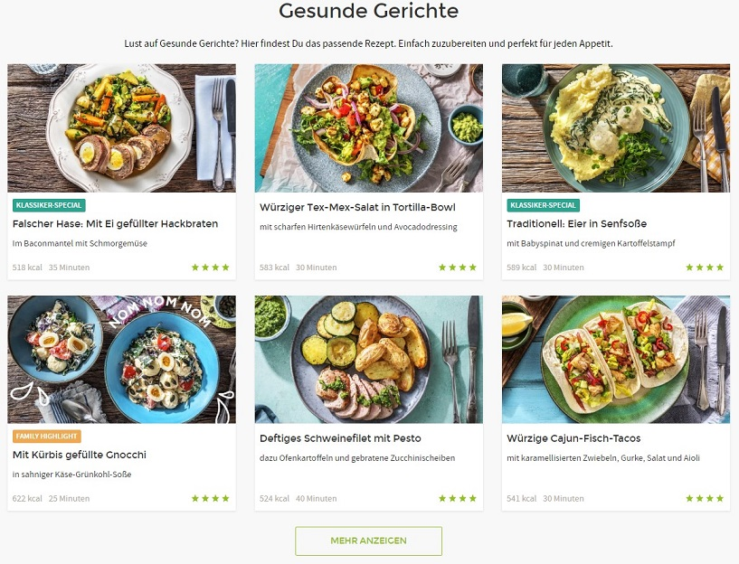
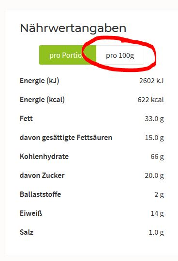

# Build a Food Recipes Dataset :rocket:

Scrapy and Selenium based Web Crawler to crawl thousands of Food Receipes for a nice DataScience Dataset.

`scrapy crawl recipe-spider`

Go to subdirectory ./recipes to see crawled recipes.

## Milestones

* Crawl all recipes which are displayed.
* __Problem:__ There is a 'Mehr Anzeigen' (Show more) Button after some few recipes, which have to be clicked to enrich more content to the site
** _Solution:_ Bind in Selenium which continuous clicks this button
	
* __Problem:__ Every recipe contains an info box about the nutrition facts (Nähwertangaben). You can choose to see the nutrition facts of one portion or of 100 grams of this meal. Default selection is the former selection. I guess it to get a cleaner dataset it is better to crawl the data normalized by the 100gr amount. Problem here is, that the data of the 100 grams selection is not included in the html source code, so do I have to run selenium at every recipe page to simulate a click at this form? Damn.
	
	
** _Solution:_ No. I found out, that there no network traffic recorded when you click that button. So the calculation has to be done locally. There is a fiels called "servingSize" in the source code, which can be used to calculate the ratio between both fields. + Further benefit: there is even more hidden date in the source, which is not shown at the website: e.g. ratingsCount, favoritesCount, ...
* __Problem:__ Selenium gets very slow / crashes after about 150 times of clicking the Show More button. Need a more resource-friendly way to crawl. First tried to delete items at the top of the page which were already crawled, but the React Backend resends them to the browser. Then I tried to set display:hide to these elements to fasten the page loading. But does not work, seems to be a network issue.
** _Solution:_ Studied HTTP traffic. Found a way to get all recipes by plain HTTP calls. See request call in sourcecode.

* __WORK IN PROGRESS__

### To-Do:
- [x] build initial spider to crawl some recipes
- [x] saving scraped recipes
- [x] simulate click html button 'Mehr Anzeigen' to see more sources
- [x] for production: click button till all content is visible
- [x] for production: add more subpages to crawl
- [x] study HTTP Requests/Responses
- [ ] send HTTP requests via python
- [ ] look for hidden data in the sourcecode, like "ratingsCount", "favoritesCount", ...
- [ ] build SQL/Pandas Dataset

### Troubleshooting
[Maybe you have to install geckodriver](https://stackoverflow.com/questions/40208051/selenium-using-python-geckodriver-executable-needs-to-be-in-path)
